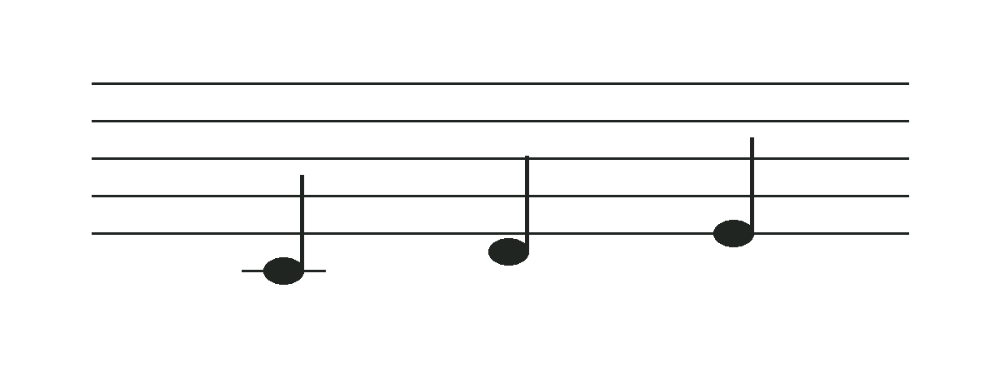

先找到一个熟悉的音，再顺着谱线读下去。本文以钢琴常用的高音谱表为例。

## 从下往上，五条线

五线谱的线从下往上数，依次是第一线到第五线。相邻两条线之间叫作“间”，也从下往上数。

音符既可以落在线上，也可以落在间里。每往上一个相邻的线或间，音名就向前走一步；超过 B 以后重新从 C 开始。

不要只数离音符最近的那条线。先确认谱号，再把熟悉的音当作参照，能减少读错八度的机会。

## 以中央 C 为起点

在高音谱表中，中央 C 位于第一线下方的一条加线上。加线是五线谱的临时延伸，穿过音符的符头。

图中从左到右是中央 C、D、E。D 在中央 C 的加线与第一线之间；E 在第一线上。此图只演示音高位置，不表示节奏或拍号。

### 把位置和键盘连起来

先在键盘中部找到两个黑键，紧挨它们左侧的白键是 C。结合键盘位置辨认中央 C，再弹出图中的三个音。

## 相邻音与跳进

从线到紧邻的间，或者从间到紧邻的线，是五线谱上相邻的位置。连续读 C、D、E 时，符头每次只移动一个位置。

从一条线直接到上一条线，中间跨过一个间。例如 C 到 E，按音名字母数包含 C、D、E 三个位置，是三度。

| 读谱线索 | 先观察什么 | 再确认什么 |
| --- | --- | --- |
| 相邻位置 | 线与间交替 | 方向向上还是向下 |
| 隔一个位置 | 线到线或间到间 | 跨过几个音名字母 |
| 加线 | 符头所在的线或间 | 谱号和参照音 |

## 试着读三个音

1. 指出图中中央 C 的加线。
2. 不弹琴，按从左到右的顺序念出 C、D、E。
3. 在键盘上慢慢弹出，再反方向弹 E、D、C。

> 读谱时先保证位置正确，再逐渐提高速度。一次只看少量音，比仓促猜完整行更容易检查。

音高和时值是两件事。接下来可以读[拍号与节奏](拍号与节奏.md)，了解怎样把音放在稳定的拍子里。
